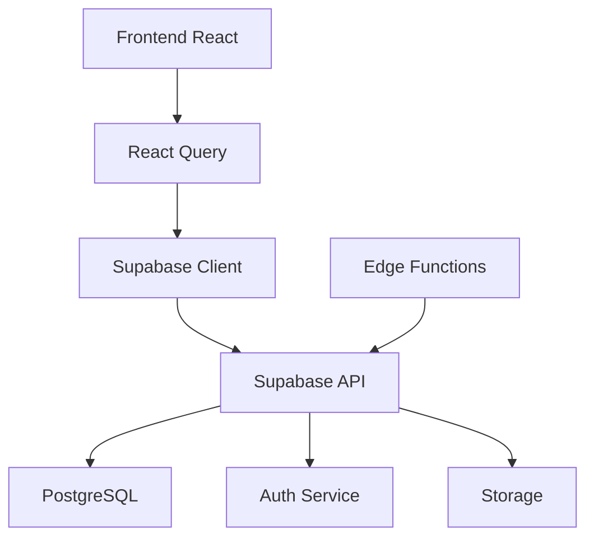

# Wiki du Projet - Application RH

## 📚 Table des matières

- [Vue d'ensemble](#vue-densemble)
- [Architecture](#architecture)
- [Installation](#installation)
- [Guides utilisateur](#guides-utilisateur)
- [Documentation technique](#documentation-technique)
- [API Reference](#api-reference)
- [Composants](#composants)
- [Déploiement](#déploiement)
- [Sécurité](#sécurité)
- [FAQ](#faq)

## 🎯 Vue d'ensemble

Cette application de gestion des ressources humaines offre une solution complète pour :

- **Gestion des employés** : CRUD complet, organigramme, profils détaillés
- **Suivi du temps** : Pointage, feuilles de temps, rapports
- **Gestion des congés** : Demandes, approbations, planning
- **Projets** : Gestion de projets, affectation des ressources
- **Calculs de salaire** : Paie automatisée, bulletins
- **Mémorandums** : Communication interne
- **Tableaux de bord** : Analytics et KPI en temps réel

### 🚀 Technologies utilisées

- **Frontend** : React 18, TypeScript, Tailwind CSS
- **UI Components** : shadcn/ui, Radix UI
- **Backend** : Supabase (PostgreSQL + Auth + Storage + Edge Functions)
- **État** : React Query, Context API
- **Routing** : React Router v6
- **Tests** : Vitest, Playwright, Testing Library
- **CI/CD** : GitHub Actions
- **Monitoring** : Sentry
- **Documentation** : Storybook, Swagger/OpenAPI

## 🏗️ Architecture

### Structure du projet

```
src/
├── components/          # Composants réutilisables
│   ├── ui/             # Composants de base (shadcn/ui)
│   ├── auth/           # Authentification
│   ├── dashboard/      # Tableaux de bord
│   ├── employees/      # Gestion employés
│   ├── time-tracking/  # Suivi du temps
│   └── ...
├── pages/              # Pages de l'application
├── services/           # Services API
├── hooks/              # Hooks personnalisés
├── lib/                # Utilitaires
├── contexts/           # Contextes React
└── types/              # Types TypeScript

supabase/
├── migrations/         # Migrations de base de données
├── functions/          # Edge Functions
└── config.toml         # Configuration Supabase

docs/
├── api/                # Spécifications OpenAPI
├── wiki/               # Documentation wiki
└── guides/             # Guides utilisateur

.storybook/             # Configuration Storybook
tests/                  # Tests E2E et d'intégration
```

### Flux de données



## 🛠️ Installation

### Prérequis

- Node.js 18+
- npm ou yarn
- Compte Supabase

### Installation locale

```bash
# Cloner le repository
git clone https://github.com/votre-org/hr-app.git
cd hr-app

# Installer les dépendances
npm install

# Configurer les variables d'environnement
cp .env.example .env.local
# Éditer .env.local avec vos clés Supabase

# Lancer le serveur de développement
npm run dev

# Lancer Storybook (optionnel)
npm run storybook
```

### Configuration Supabase

1. Créer un nouveau projet Supabase
2. Exécuter les migrations : `supabase db push`
3. Configurer l'authentification
4. Ajouter les variables d'environnement

## 👥 Guides utilisateur

### 🔐 Connexion et authentification

1. **Première connexion**
   - Utiliser l'email d'invitation reçu
   - Créer un mot de passe sécurisé
   - Configurer l'authentification à deux facteurs (MFA)

2. **Configuration du profil**
   - Ajouter une photo de profil
   - Compléter les informations personnelles
   - Définir les préférences

### 👨‍💼 Gestion des employés

#### Ajouter un employé

1. Naviguer vers "Employés" → "Ajouter"
2. Remplir le formulaire :
   - Informations personnelles
   - Poste et département
   - Informations de contact
   - Salaire et avantages
3. Assigner un manager
4. Définir les permissions

#### Modifier un employé

1. Rechercher l'employé dans la liste
2. Cliquer sur "Modifier"
3. Mettre à jour les informations
4. Sauvegarder les modifications

### ⏰ Suivi du temps

#### Pointer l'arrivée/départ

1. Utiliser les boutons "Arrivée" / "Départ" sur le dashboard
2. Le système enregistre automatiquement l'heure
3. Possibilité d'ajouter un commentaire

#### Saisir des heures manuellement

1. Aller dans "Suivi du temps" → "Nouvelle entrée"
2. Sélectionner la date et le projet
3. Saisir les heures début/fin
4. Ajouter une description des tâches

### 🏖️ Demandes de congés

#### Soumettre une demande

1. Naviguer vers "Congés" → "Nouvelle demande"
2. Choisir le type de congé
3. Sélectionner les dates
4. Ajouter un motif si nécessaire
5. Soumettre pour approbation

#### Approuver/refuser (managers)

1. Consulter les demandes en attente
2. Examiner les détails de la demande
3. Approuver ou refuser avec commentaire
4. L'employé est notifié automatiquement

## 🔧 Documentation technique

### Base de données

#### Schéma principal

**employees**
- Informations personnelles et professionnelles
- Relations hiérarchiques (manager_id)
- Audit trail (created_at, updated_at)

**time_entries**
- Enregistrements de temps de travail
- Lien vers les projets
- Statut d'approbation

**leave_requests**
- Demandes de congés
- Workflow d'approbation
- Types de congés configurables

**projects**
- Gestion de projets
- Affectation des ressources
- Suivi de la progression

#### Row Level Security (RLS)

Toutes les tables utilisent RLS pour sécuriser l'accès :

```sql
-- Exemple : Les employés ne voient que leurs propres données
CREATE POLICY "employees_own_data" ON employees
  FOR SELECT USING (auth.uid() = user_id);

-- Les managers voient leur équipe
CREATE POLICY "managers_team_data" ON employees
  FOR SELECT USING (manager_id = auth.uid());
```

### API

L'API suit les conventions REST avec :

- **GET** : Lecture des données
- **POST** : Création
- **PUT** : Modification complète
- **PATCH** : Modification partielle
- **DELETE** : Suppression

#### Authentification

Toutes les requêtes nécessitent un token Bearer :

```javascript
headers: {
  'Authorization': `Bearer ${token}`,
  'Content-Type': 'application/json'
}
```

#### Pagination

Les listes utilisent la pagination offset :

```javascript
GET /api/employees?page=1&limit=20&search=dupont
```

#### Gestion d'erreurs

Format standardisé des erreurs :

```json
{
  "error": {
    "message": "Validation failed",
    "code": "VALIDATION_ERROR",
    "details": {
      "email": "Email is required"
    }
  }
}
```

### Sécurité

#### Authentification multi-facteurs (MFA)

- Support TOTP avec Google Authenticator, Authy
- Codes de récupération
- Politique de mots de passe robuste

#### Chiffrement des données

- Données sensibles chiffrées en base
- Communications HTTPS uniquement
- Tokens JWT avec expiration

#### Audit et logs

- Toutes les actions utilisateur loggées
- Monitoring avec Sentry
- Alertes de sécurité automatiques

## 📋 API Reference

Voir la [documentation OpenAPI complète](./api/api-spec.yaml) ou consultez l'interface Swagger UI intégrée.

### Endpoints principaux

#### Employés

```
GET    /api/employees           # Liste des employés
POST   /api/employees           # Créer un employé
GET    /api/employees/:id       # Détails d'un employé
PUT    /api/employees/:id       # Modifier un employé
DELETE /api/employees/:id       # Supprimer un employé
```

#### Temps de travail

```
GET    /api/time-entries        # Entrées de temps
POST   /api/time-entries        # Nouvelle entrée
PUT    /api/time-entries/:id    # Modifier une entrée
DELETE /api/time-entries/:id    # Supprimer une entrée
```

#### Congés

```
GET    /api/leave-requests      # Demandes de congé
POST   /api/leave-requests      # Nouvelle demande
PUT    /api/leave-requests/:id  # Modifier une demande
```

## 🎨 Composants

### Design System

Le projet utilise un design system basé sur :

- **Couleurs** : Thème cohérent avec mode sombre/clair
- **Typographie** : Hiérarchie claire, lisibilité optimale
- **Espacement** : Grille de 4px pour la cohérence
- **Composants** : Librairie shadcn/ui extensible

### Storybook

Documentation interactive des composants disponible en lançant :

```bash
npm run storybook
```

### Composants principaux

#### Button

```tsx
import { Button } from '@/components/ui/button';

<Button variant="default" size="md">
  Action principale
</Button>
```

#### Card

```tsx
import { Card, CardHeader, CardTitle, CardContent } from '@/components/ui/card';

<Card>
  <CardHeader>
    <CardTitle>Titre</CardTitle>
  </CardHeader>
  <CardContent>
    Contenu de la carte
  </CardContent>
</Card>
```

## 🚀 Déploiement

### Environnements

- **Development** : Déploiement automatique depuis `develop`
- **Staging** : Tests complets avant production
- **Production** : Déploiement avec approbation manuelle

### Pipeline CI/CD

1. **Tests** : Lint, unit tests, E2E tests
2. **Build** : Optimisation et bundling
3. **Déploiement** : Déploiement automatique ou manuel
4. **Monitoring** : Health checks et alertes

### Variables d'environnement

```env
VITE_SUPABASE_URL=your_supabase_url
VITE_SUPABASE_ANON_KEY=your_anon_key
VITE_SENTRY_DSN=your_sentry_dsn
```

## 🔒 Sécurité

### Bonnes pratiques

1. **Authentification forte** : MFA obligatoire
2. **Principe du moindre privilège** : Permissions minimales
3. **Chiffrement** : Données sensibles protégées
4. **Audit** : Traçabilité complète
5. **Mise à jour** : Dépendances maintenues à jour

### Conformité

- **RGPD** : Gestion des données personnelles
- **ISO 27001** : Sécurité de l'information
- **SOC 2** : Contrôles de sécurité

## ❓ FAQ

### Questions générales

**Q : Comment réinitialiser mon mot de passe ?**
R : Utilisez le lien "Mot de passe oublié" sur la page de connexion.

**Q : Puis-je exporter mes données ?**
R : Oui, des exports sont disponibles dans les paramètres du compte.

### Questions techniques

**Q : Comment contribuer au projet ?**
R : Consultez le guide de contribution dans CONTRIBUTING.md.

**Q : Comment signaler un bug ?**
R : Utilisez les issues GitHub ou contactez le support.

**Q : Quelle version de Node.js est supportée ?**
R : Node.js 18+ est requis pour le développement.

---

## 📞 Support

- **Email** : support@example.com
- **Documentation** : [Wiki complet](./wiki/)
- **Issues** : [GitHub Issues](https://github.com/votre-org/hr-app/issues)
- **Slack** : #hr-app-support

---

*Dernière mise à jour : Janvier 2025*